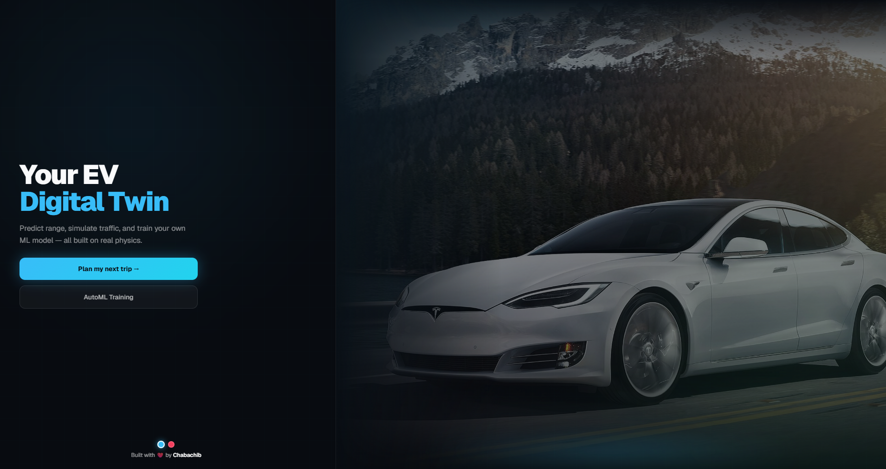
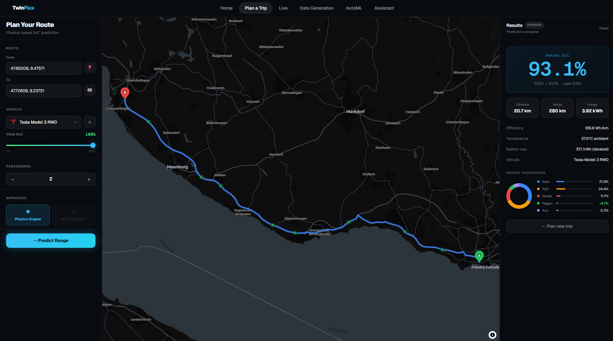
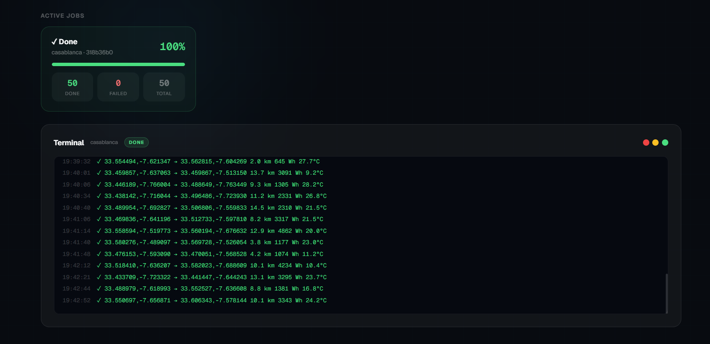
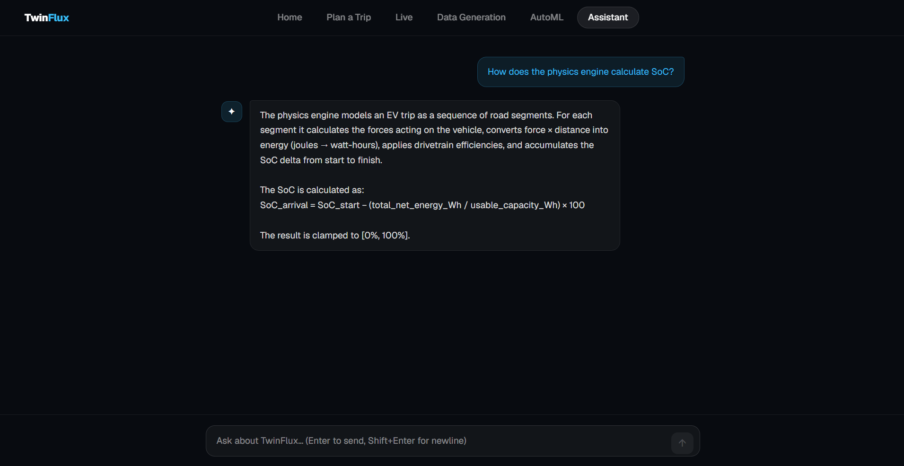

<h1 align="center">TwinFlux</h1>

<p align="center">
  <strong>A physics-based electric vehicle intelligence platform — built from scratch, end to end.</strong>
</p>

<p align="center">
  
  
  
  
  
  
  
  
</p>

<br />

<p align="center">
  
</p>

---

## The Problem

The starting point was simple: I wanted to use [ABRP (A Better Route Planner)](https://abetterrouteplanner.com) in a project, but the API is paid. That led to a question — *why pay for it when I can build something just as accurate myself?*

So I did. I found the DEVRT dataset — real Nissan Leaf trips with ground-truth GPS, speed, and SoC measurements — and used it as the foundation. I built a physics engine from scratch (drag, rolling resistance, grade, regen, temperature derating), ran it against all 29 trips, tuned the calibration, and compared the predictions against ABRP's output for the same routes. The results were very close enough to validate the approach.

From there I scaled: I added four more vehicles (Tesla Model 3, BMW iX3, Mercedes CLA EQ, VolksWagen ID. Polo), extracted their physics constants from [Electric Vehicle Database](https://ev-database.org), calibrated each one, and tested them across a wide range of routes. The physics held.

But real EV data is scarce. You can't find large labeled datasets of real trips for a specific vehicle freely available. So the next logical step was to generate my own — using SUMO traffic simulation to produce synthetic driving cycles, feeding them through the physics engine to produce labeled data, and studying how each vehicle would perform under different conditions. The goal is to close the sim-to-real gap: generate enough synthetic data to train and validate models, then, once real telemetry becomes available from actual hardware, compare and refine.

The end goal is a full digital twin of an electric vehicle — not just range prediction, but predictive maintenance, fault detection, battery degradation modeling, and real-time calibration as the vehicle ages. TwinFlux is the foundation for that.

---

## Demo

### Trip Planner — Physics Engine


A Tesla Model 3 RWD trip along Lake Constance from Überlingen to Friedrichshafen (20.7 km). Starting at 100% SoC, the physics engine predicted **93.1% on arrival** — consuming 3.92 kWh at 189.6 Wh/km. The energy breakdown donut tells the full story: rolling resistance leads at 24.4%, aerodynamic drag at 21.9%, grade forces at 11.7%, auxiliary loads at 5.2%, and regenerative braking recovering 4.7% back. Ambient temperature (27.5°C) and the vehicle's derated usable capacity (57.1 kWh) are factored in automatically. Every number on that results panel comes from the physics model — nothing is estimated from a lookup table.

---

### Data Generation — SUMO Synthetic Trips


A completed batch job generating 50 synthetic EV trips in Casablanca — 50 done, 0 failed, in roughly 3 minutes. The live terminal streams each completed trip as it finishes: origin and destination coordinates, route distance, energy consumed in Wh, and ambient temperature. The output is a fully labeled dataset ready for ML training. This is the core answer to the data scarcity problem: when you can't find real-world EV telemetry, you generate it yourself — with a physics engine you trust because you've already validated it against real trips.

---

### RAG Assistant — Knowledge-Grounded Answers


The TwinFlux Assistant answering a precise technical question: *"How does the physics engine calculate SoC?"* The response is accurate and specific — it explains the segment-by-segment force calculation, the joules-to-watt-hours conversion, drivetrain efficiency stacking, and gives the exact formula used internally. This is not a general-purpose chatbot guessing at domain knowledge. The answer is retrieved from a knowledge base that I wrote, indexed in Milvus, and grounded through a LangChain RAG pipeline backed by Gemini 2.0 Flash. It streams token by token and handles the kind of technical questions that general LLMs would hallucinate on.

---

## What I Built

TwinFlux is a full-stack platform that combines a custom physics engine, traffic simulation, machine learning, and a RAG-powered assistant into a unified interface for EV intelligence.

**Trip Planner** — Given a start, destination, departure time, and initial battery state, the platform routes the trip over real OSM road data, generates a kinematic speed profile using SUMO traffic simulation, fetches live weather for the location and time, and runs a full energy model over every segment. The result is a precise arrival SoC estimate with a breakdown of exactly where the energy went.

**Live Telemetry Dashboard** — A real-time session interface that streams vehicle state at 1 Hz: GPS position on a live map, speed, power draw, regenerative braking direction, SoC arc gauge, estimated range, and session metrics. Architected for real hardware integration when telemetry APIs are available.

**Data Generation Pipeline** — An end-to-end synthetic dataset generator powered by SUMO. Configure a city, time window, fleet, and weather conditions — the system produces labeled driving datasets ready for ML training, stored in object storage.

**AutoML Training Interface** — Upload your own battery telemetry, choose a prediction task (SoC estimation, SoH prediction, remaining range, or fault detection), configure the search, and launch an experiment. The runner searches across eight model families and surfaces the best result with full metrics and trial comparison. Tracked in MLflow.

**RAG-powered Assistant** — A context-aware AI assistant built on a LangChain LCEL pipeline, Milvus vector store, and Gemini 2.0 Flash. The knowledge base covers the physics model, vehicle parameters, results interpretation, and platform architecture. Answers stream token by token over SSE.

**Vehicle Management** — Add any EV to the platform by entering its physics constants. The parameters feed directly into the energy model for every prediction.

---

## Architecture

The system is organized into three functional layers:

```
┌─────────────────────────────────────────────────────────────────┐
│                        Presentation Layer                        │
│          Next.js 15 · React 19 · MapLibre GL · Tailwind         │
└────────────────────────────┬────────────────────────────────────┘
                             │
┌────────────────────────────▼────────────────────────────────────┐
│                       Intelligence Layer                         │
│   Physics Engine · SUMO Traffic Sim · LightGBM SoC Model        │
│   AutoML Runner (Optuna) · LangChain RAG · Gemini 2.0 Flash     │
│                      FastAPI · Python 3.11                       │
└──────┬──────────┬──────────┬──────────┬──────────────┬──────────┘
       │          │          │          │              │
┌──────▼──┐ ┌────▼───┐ ┌────▼───┐ ┌────▼───┐ ┌───────▼──────┐
│Postgres │ │ Redis  │ │ MinIO  │ │ Milvus │ │    MLflow    │
│vehicles │ │jobs/   │ │dataset │ │vector  │ │  experiment  │
│& trips  │ │ SSE    │ │storage │ │  DB    │ │  tracking    │
└─────────┘ └────────┘ └────────┘ └────────┘ └──────────────┘
```

Every component runs in Docker Compose. The intelligence layer is stateless — it reads from and writes to the data layer, which means each service can be scaled or replaced independently.

---

## Technology Choices & Why

| Technology | Role | Why I chose it |
|---|---|---|
| **FastAPI** | Backend API | Async-native, automatic OpenAPI docs, excellent for SSE streaming |
| **Next.js 15** | Frontend | App Router, server components, zero-config TypeScript |
| **MapLibre GL** | Maps | Open-source, no API key wall, full vector tile support |
| **SUMO** | Traffic simulation | Gold-standard open traffic simulator, integrates with real OSM road networks |
| **LightGBM** | SoC estimation | Outperforms neural nets on tabular data at this scale, fast inference |
| **Optuna** | AutoML search | Bayesian optimization, pruning, clean trial management |
| **MLflow** | Experiment tracking | Self-hosted, integrates with any framework, clean comparison UI |
| **Milvus** | Vector store | Production-grade, supports shared MinIO storage, Attu web UI |
| **LangChain LCEL** | RAG pipeline | Composable, streaming-native, clean retriever → prompt → LLM chain |
| **Gemini 2.0 Flash** | LLM + embeddings | Free tier sufficient for this scale, fast token generation |
| **MinIO** | Object storage | S3-compatible, self-hosted, shared between Milvus and dataset storage |
| **Redis** | Job queue + SSE | Pub/sub for live session broadcasting, ephemeral job state |
| **PostgreSQL** | Primary database | Reliable, SQLAlchemy integration, vehicle and trip persistence |

---

## My Contributions

This is a solo project. Every line of code, every architectural decision, and every design choice is mine.

- **Physics engine** — Designed and implemented from scratch. Models aerodynamic drag, rolling resistance, grade force, regenerative braking recovery, auxiliary loads, and temperature derating. Calibrated against published manufacturer data and validated on real-world trip datasets.

- **SUMO integration** — Built the pipeline that takes an OSM origin/destination pair, downloads the road network, generates a realistic kinematic speed profile using SUMO, and feeds it into the energy model. Handles caching, network pooling, and parallel simulation workers.

- **RAG system** — Designed the knowledge base (8 technical documents), built the LangChain pipeline with Milvus vector retrieval, wired the SSE streaming endpoint, and wrote the full chat UI with real-time token streaming.

- **AutoML runner** — Built the search space, task definitions, Optuna integration, MLflow logging, model serialization, and the inference tab with live prediction. Implemented PINN (Physics-Informed Neural Network) as one of the candidate model families.

- **Infrastructure** — Designed the full Docker Compose stack, CI/CD pipeline for production deployment via GitHub Actions, and the Watchtower-based rolling update strategy.

- **UI/UX** — Designed all pages from scratch — no component library, all inline styles with a custom theme system (two color modes with smooth live transitions).

---

## Challenges

**Getting the physics right.** The hardest part wasn't writing the physics equations — it was calibrating them. Real-world energy consumption doesn't match the textbook formulas unless you account for drivetrain efficiency curves, battery internal resistance at different temperatures, and the non-linear relationship between speed and drag. Iterative validation against the DEVRT dataset (29 real Nissan Leaf trips) was essential.

**SUMO at scale.** SUMO is powerful but slow. A single trip simulation takes several seconds. For the data generation pipeline that needs to produce hundreds of trips, I had to build a network caching layer (OSM downloads are reused), a parallel worker pool, and a checkpoint system so interrupted runs resume from where they left off.

**Milvus infrastructure.** Running Milvus in standalone mode requires etcd for metadata and shares object storage with the rest of the stack. Getting the MinIO credential handoff between the `user.yaml` config override and the running MinIO instance to work correctly required understanding Milvus internals that aren't well documented.

**Streaming the RAG response.** Building a token-by-token SSE stream through the full LangChain LCEL chain (retriever → prompt → LLM → output parser) while keeping the FastAPI endpoint non-blocking and the frontend state machine correct required careful async wiring on both sides.

**AutoML heterogeneity.** Battery telemetry data varies wildly in schema between manufacturers and collection methods. Building an AutoML runner that accepts arbitrary CSV/Excel/JSON uploads and still produces meaningful models required robust feature inference, schema normalization, and task-specific feature engineering.

---

## Results & Performance

| Metric | Value | Context |
|---|---|---|
| SoC estimation MAE | **±0.5%** | Validated on 29 real Nissan Leaf trips (DEVRT dataset) |
| Wh/km prediction error | **±0.6%** | Against DEVST benchmark methodology |
| Trip prediction time | **< 5 seconds** | End-to-end: route → traffic → weather → energy → SoC |
| Supported vehicles | **5 EVs** | Nissan Leaf, Tesla Model 3, BMW iX3, Mercedes CLA EQ, VW ID. Polo |

---

## Validation Datasets

| Dataset | Role |
|---|---|
| [DEVST](https://opendatasets.vicomtech.org/di23-devst-dataset-of-electric-vehicle-simulated-trips/d913b9ff) | Evaluation methodology reference and benchmark |
| [DEVRT](https://opendatasets.vicomtech.org/di23-devrt-dataset-of-electric-vehicle-real-trips/) | Primary validation — 29 real Nissan Leaf trips with ground-truth SoC |

---

## Deployment

The full stack runs on a single VPS from **Oracle Cloud** via Docker Compose. Production uses a separate `docker-compose.prod.yml` with resource limits, restart policies, and no development tooling. Deployments are automated: a GitHub Actions workflow builds and pushes new images on every push to `main`, and Watchtower running on the server picks up the new images and performs a rolling restart with zero downtime.

The choice of a VPS over managed cloud services is deliberate and financially responsible. Spinning up managed Kubernetes, RDS, ElastiCache, and S3 for a project at this scale would cost hundreds of dollars a month for no meaningful benefit. A VPS handles the full stack — FastAPI, Next.js, PostgreSQL, Redis, MinIO, Milvus, MLflow, Grafana — comfortably, at a fraction of the cost. The goal was to build something real and production-grade, not to burn money on infrastructure overkill. Everything is self-hosted and reproducible on any Linux machine with Docker installed.

---

<p align="center">Built with ❤️ by <strong>Chabachib</strong></p>
